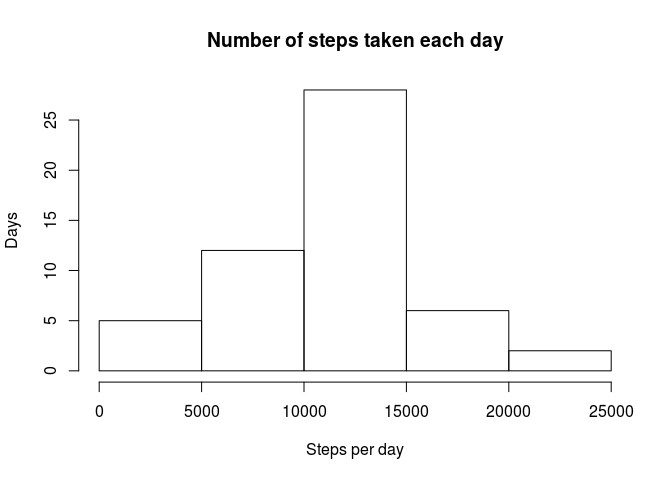
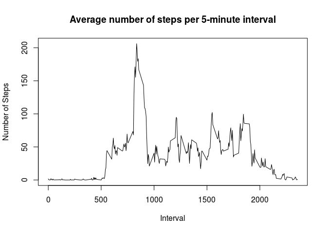
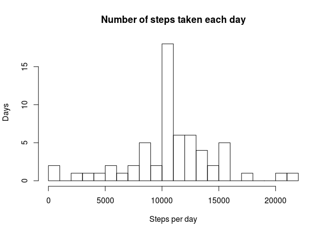
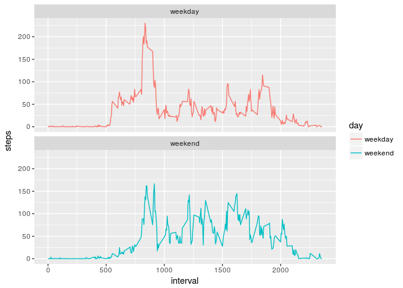

# Reproducible Research: Peer Assessment 1

##Code for reading in the dataset and/or processing the data
Load the data (i.e. 𝚛𝚎𝚊𝚍.𝚌𝚜𝚟()). Process/transform the data (if necessary) into a format suitable for your analysis.


```r
library(plyr)
unzip(zipfile="activity.zip")
data <- read.csv("activity.csv")
data$date <- as.Date(data$date, format = "%Y-%m-%d")
```
Explore the data:

```r
head(data)
```

```
##   steps       date interval
## 1    NA 2012-10-01        0
## 2    NA 2012-10-01        5
## 3    NA 2012-10-01       10
## 4    NA 2012-10-01       15
## 5    NA 2012-10-01       20
## 6    NA 2012-10-01       25
```

```r
str(data)
```

```
## 'data.frame':	17568 obs. of  3 variables:
##  $ steps   : int  NA NA NA NA NA NA NA NA NA NA ...
##  $ date    : Date, format: "2012-10-01" "2012-10-01" ...
##  $ interval: int  0 5 10 15 20 25 30 35 40 45 ...
```

##Histogram of the total number of steps taken each day

```r
steps_per_day <- tapply(data$steps, data$date, sum)

hist(
  steps_per_day,
  xlab = "Steps per day", 
  ylab = "Days", 
  main = "Number of steps taken each day"
)
```

<!-- -->

##Mean and median number of steps taken each day

```r
mean(steps_per_day, na.rm = TRUE)
```

```
## [1] 10766.19
```


```r
median(steps_per_day, na.rm = TRUE)
```

```
## [1] 10765
```


##Time series plot of the average number of steps taken

```r
data.intetval <- aggregate(data[1], by=data[3], FUN=mean, na.rm=TRUE)
plot(
  x = data.intetval$interval,
  y = data.intetval$steps,
  type="l",
  main="Average number of steps per 5-minute interval",
  ylab="Number of Steps",
  xlab="Interval"
)
```

<!-- -->
A time series plot (i.e. 𝚝𝚢𝚙𝚎 = "𝚕") of the 5-minute interval (x-axis) and the average number of steps taken, averaged across all days (y-axis).

###Max steps per interval and max interval:

```r
res <- data.intetval[data.intetval$steps == max(data.intetval$steps),]

round(res[2],1)
```

```
##     steps
## 104 206.2
```

```r
res[1]
```

```
##     interval
## 104      835
```

##Code to describe and show a strategy for imputing missing data
Imputing missing values.


```r
total_len <- length(data$steps)
na_len <- length(which(is.na(data$steps)))
pers <- (na_len/total_len) * 100
```
Total number of missing values in the dataset (i.e. the total number of rows with 𝙽𝙰s) is 17568. Missing values 2304 is 13.1147541%

Fill in the missing data with mean-derived values:

```r
library(plyr)
i_mean <- function(x) replace(x, is.na(x), mean(x, na.rm=TRUE))
imputed <- ddply(data, ~interval, transform, steps=i_mean(steps))
```

##Histogram of the total number of steps taken each day after missing values are imputed

```r
imputed.date <- aggregate(imputed[1], by=imputed[2], FUN=sum, na.rm=TRUE)
hist(
  imputed.date$steps,
  breaks=30,
  xlab = "Steps per day", 
  ylab = "Days", 
  main = "Number of steps taken each day"
)
```

<!-- -->

The mean and median total number of steps taken per day:

```r
mean(imputed.date$steps)
```

```
## [1] 10766.19
```

```r
median(imputed.date$steps)
```

```
## [1] 10766.19
```

##Panel plot comparing the average number of steps taken per 5-minute interval across weekdays and weekends
Creating a new factor variable in the dataset with two levels – “weekday” and “weekend” indicating whether a given date is a weekday or weekend day.

```r
week <- function(date) {
  if (format(as.Date(date), "%w") %in% c(6, 0)) {
    "weekend"
  } else {
    "weekday"
  }
}
imputed$day <- as.factor(sapply(imputed$date, week))
imputed.interval <- aggregate(steps ~ interval + day, data=imputed, FUN=mean)
```
Creating a panel plot containing a time series plot of the 5-minute interval (x-axis) and the average number of steps taken, averaged across all weekday days or weekend days (y-axis).

```r
library(ggplot2)
ggplot(
  imputed.interval, 
  aes(x=interval, y=steps)) + 
  geom_line(aes(color=day)) + 
  facet_wrap(~day, ncol=1, nrow=2)
```

<!-- -->

